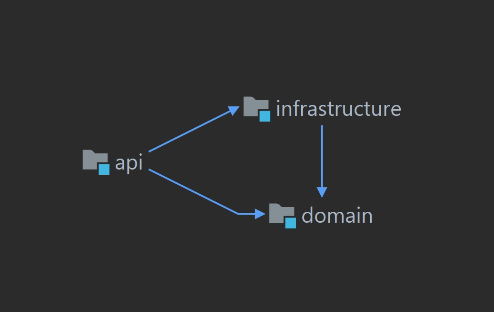
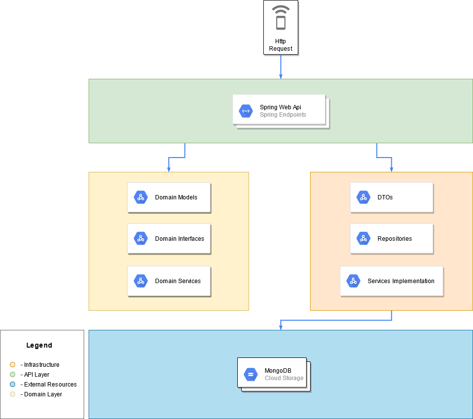
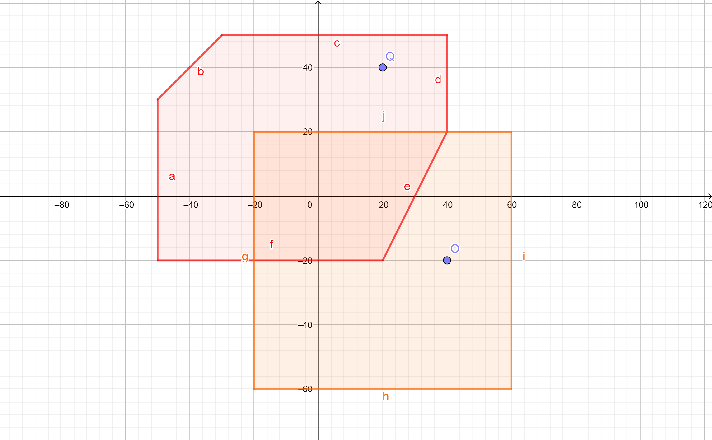

<h1 align="center">
     <a href="#"> Zé Delivery Backend Challenge </a>
</h1>


## Summary

* [Project Structure](#project-architectural-structure-and-dependency)
* [Before Start](#before-start)
* [How to start: On Docker](#on-docker)
* [How to start: On IDE](#on-ide)
* [Test Case Observations](#test-case-observations)
* [Get in Touch](#get-in-touch)


## Project Architectural Structure and Dependency


- The diagram above was generate by IntelliJ IDEA



---

### Before Start

- [Git](https://git-scm.com).*
- [Docker](https://docs.docker.com/get-docker/)*
- [Java 15](https://www.oracle.com/br/java/technologies/javase-jdk15-downloads.html).
- Java IDE of your preference.

* If you only want to run the project, you will need only docker and git.

---

## How to start

### On Docker

- Go to the root folder of the project
- Navigate to ```.\api\src\main\resources```
- Open the file ```application.properties```
- Make sure to change the property ```spring.data.mongodb.host``` to match your machine IPV4
- Run ```docker-compose up --build```
- Open [Swagger UI](http://localhost:8080/api/v1/swagger-ui.html)
- You can use Postman for your requests. [Click Here](https://www.getpostman.com/collections/1ddc11077ac30ad48d18) to get the collection.

## On IDE

- Import the project inside your preferred IDE
- Make sure all modules were imported.
- Run ```docker-compose --file docker-compose-mongodb.yml up``` on the root folder
- Run ```ApiApplication``` inside api module
- Open [Swagger UI](http://localhost:8080/api/v1/swagger-ui.html)
- You can use Postman for your requests. [Click Here](https://www.getpostman.com/collections/1ddc11077ac30ad48d18) to get the collection.


## Test Case Observations

- To create a single partner you must use a structure as showed on json bellow:

```json
{
  "id": 1, 
  "tradingName": "Adega da Cerveja - Pinheiros",
  "ownerName": "Zé da Silva",
  "document": "1432132123891/0001",
  "coverageArea": { 
    "type": "MultiPolygon", 
    "coordinates": [
      [[[30, 20], [45, 40], [10, 40], [30, 20]]], 
      [[[15, 5], [40, 10], [10, 20], [5, 10], [15, 5]]]
    ]
  },
  "address": { 
    "type": "Point",
    "coordinates": [-46.57421, -21.785741]
  }
}
```

- To create multiple partners at once, you can use the structure presented on this [json](files/massive-data.json) or use it.

- To search the nearest partner use the bellow json in the body request:
```json
{
    "longitude": "-43.2960",
    "latitude": "-23.0065"
}
```

- The unit tests were hard to simulate, that said I've created a mocked data for two polygons and used them for the unit tests. The image bellow represents those polygons.



- Consider Q and O the simulation of address of each polygon.
## Get in touch
[](https://www.linkedin.com/in/katsshura/)
[](mailto:xr.emerson@gmail.com)
